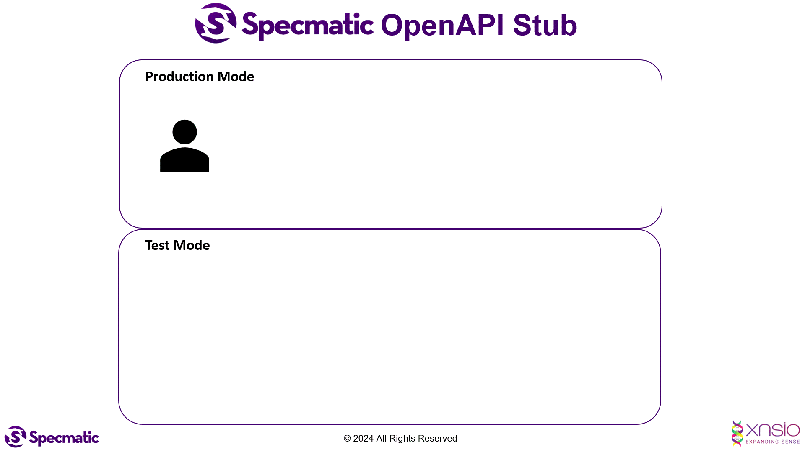

# React Jest UI Component Testing with Specmatic
This project demonstrates stubbing APIs with Specmatic by leveraging their OpenAPI specifications in Jest UI Component Tests.

## Install dependencies
```shell
npm install
```

### Start the application
```shell
npm start
```

## Running automated UI Component tests with Specmatic
```shell
npm test
```

## Updating the stub expectations
Refer to this [documentation](https://specmatic.io/documentation/test_data_format.html) in order to understand how to update the stub expectations.

## FAQs

### 1. Error `ReferenceError: setImmediate is not defined`

This happens due to an issue in Jest. The easiest solution is to import `core-js` in the affected test file.
